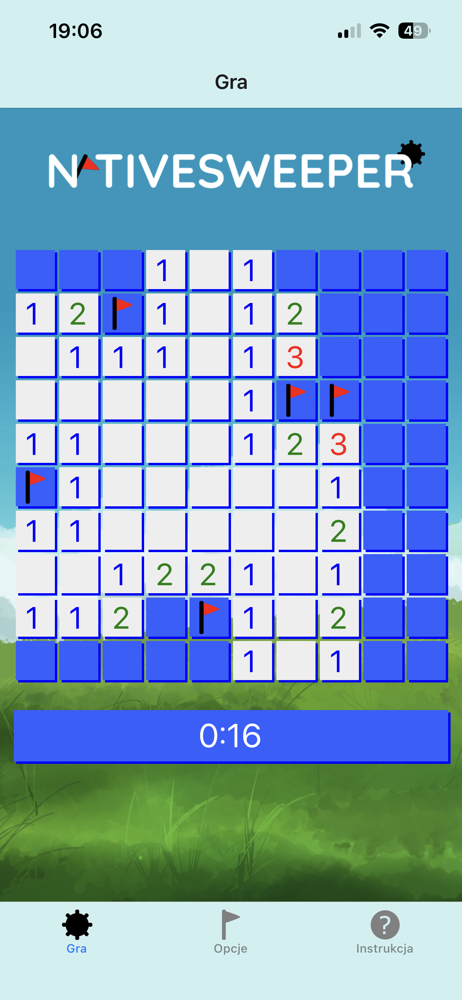
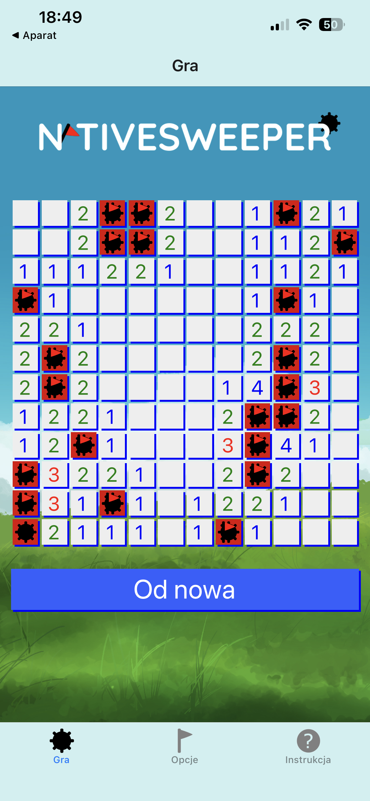
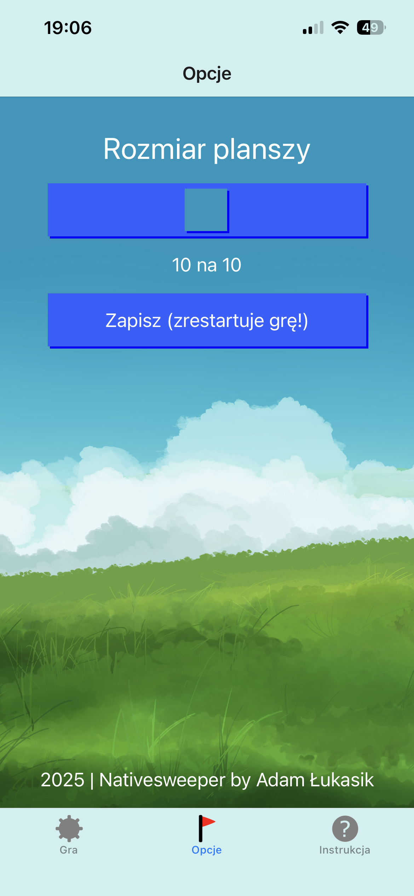
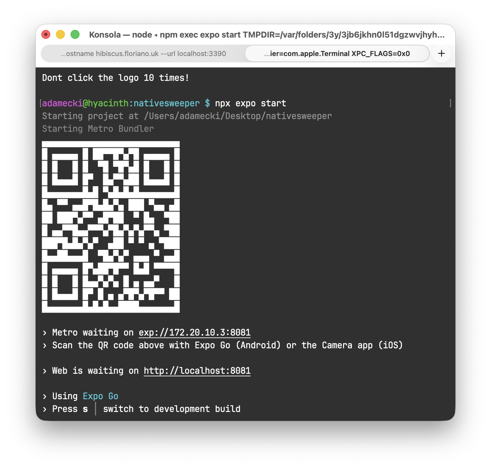

# Nativesweeper
Nativesweeper to gra mobilna będąca klonem windowsowego "Sapera" zaprojektowana z użyciem React Native oraz Expo Go.


# O grze

Zasady gry są takie same jak w przypadku Sapera, a więc:
- Plansza składa się z pól "pustych" oraz zawierających miny,
- Po naciśnięciu na puste pole jest ono odkrywane, po naciśnięciu na pole z miną następuje koniec gry,
- Puste pola wyświetlają liczbę "zaminowanych" pól z nimi graniczących,
- Gdy pole nie graniczy z żadnymi minami, przy jego odkryciu odkrywane są wszystkie pola dookoła.

Sterowanie jest dostosowane dla ekranów dotykowych:
- Dotknięcie pustego pola lub pola z numerkiem (pod warunkiem że ilość graniczących z nim flag jest odpowiednia) odsłania odpowiednio to pole i wszystkie pola graniczące,
- Przytrzymanie nieodsłoniętego pola dodaje lub usuwa flagę na tym polu.


Ustawienia gry umożliwiają dostosowanie rozmiaru kwadratowej planszy, rozpoczynając od 8 na 8 pikseli, kończąc na 12 na 12 pikseli. Około 16% pól na planszy zawiera miny.

# Wykorzystane biblioteki
- React Navigation
- React Native Reanimated
- React Native SVG
- React Native Gesture Handler
- React Native Async Storage

# Uruchomienie
## Wymagania
- Git (do sklonowania repozytorium, ewentualnie można pobrać ZIP i wypakować),
- node.js v25.1.0 lub nowszy,
- Android Studio (jeśli aplikacja jest uruchamiana na emulatorze Androida).

## Emulator Androida
- Skonfiguruj [emulator Androida](https://docs.expo.dev/get-started/set-up-your-environment/?platform=android&device=simulated).
- Sklonuj repozytorium:
```bash
git clone https://github.com/adamecki/nativesweeper
cd nativesweeper
```
- Zainstaluj zależności:
```bash
npm install
```
- Uruchom serwer:
```
npx expo start
```
- Wciśnij 'a', aby uruchomić aplikację w emulatorze.

## Urządzenie z systemem Android lub iOS
- Pobierz aplikację Expo Go ze [Sklepu Play](https://play.google.com/store/apps/details?id=host.exp.exponent) lub [App Store](https://apps.apple.com/pl/app/expo-go/id982107779).
- Zaloguj lub zarejestruj się w aplikacji.
- Upewnij się, że smartfon znajduje się w tej samej sieci co komputer.
- Sklonuj repozytorium:
```bash
git clone https://github.com/adamecki/nativesweeper
cd nativesweeper
```
- Zainstaluj zależności:
```bash
npm install
```
- Uruchom serwer:
```bash
npx expo start
```
- Pojawi się kod QR. Zeskanuj go smartfonem i aplikacja uruchomi się w Expo Go.

